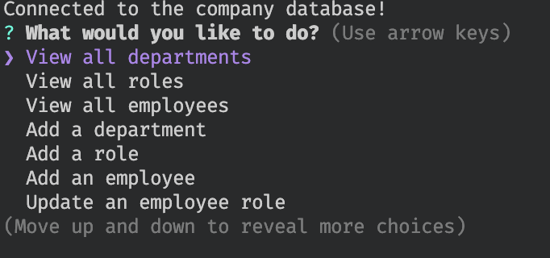

# Employee Tracker
 

## Description
This command-line application allows business owners to view and manage departments, roles, and employees in their company. The application uses Node.js, Inquirer, and PostgreSQL to provide a simple interface for managing employee data.

## Table of Contents

- [Installation](#installation)
- [Features](#features)
- [License](#license)

## Installation
To install necessary dependencies, run the following command:
1. Clone the repository:
```
git clone https://github.com/yueyue426/employee-tracker.git
```
2. Navigate to the project directory:
```
cd employee-tracker
```
3. Install Inquirer version 8.2.4:
```
npm install inquirer@8.2.4
```
4. Install pg
```
npm install pg
```
5. Set up your PostgreSQL database and create the necessary tables:
```
psql -U yourUsername 
cd db
\i schema.sql
\i seeds.sql
```

## Features
The application allows users to:
- Vier all departments, roles, and employees
- Add departments, roles, and employees
- Update employee roles

## License
This project is licensed under the [MIT](https://opensource.org/licenses/MIT)  License.

## Mock Up


